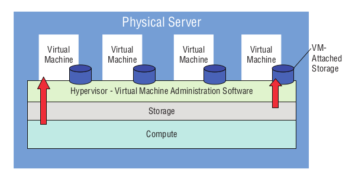
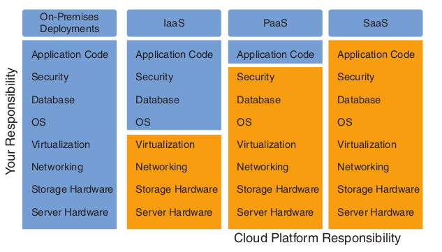

# The Cloud

Using a public cloud is about using other people’s servers to run your digital workloads - this is in short what Cloud Computing is!

## What are the main features of cloud computing?

- **Highly Available and Scalable Resources**
  - AWS is designed with multiple layer of redundancy, so when a component fails, its workload is automatically moved to a healthy replacement.
  - Resources can be connected together across geographical regions allowing for the relation of services automatically in the case of a failure
  - Provide customers with access to as much on-demand compute power as they require
  - Due to scale and efficiency of the platform, this is achievable at affordable prices
- **Professionally Secured Infrastructure**
  - IT security is constantly moving, and thus is difficult to manage new and upcoming security threats.
  - AWS takes responsibility for the security of its platform’s underlying networking and compute infrastructure, and thus you can use the AWS security expertise.
  - Note you are still responsible for your applications, it's *the cloud itself* that is managed by AWS.

- **Metered Payment Model**
  - The flexibility of the self-serve system permits usage patterns that would have been impossible using traditional compute paradigms.
  - Instances can be turned on for a few minutes (in an automated fashion), rather than than asking humans to provision infrastructure that might take hours or days.
  - You will only be billed for only the time that your instances are running for, which, in some cases, could cost you a fraction of a penny
  - On-premises infrastructure tends to be very capex-heavy since you need to purchase loads of expensive hardware up front, instead AWS costs are ongoing, consisting mostly of per-hour resource “rental” fees.

## Server Virtualisation

The secret sauce that lets cloud providers give their customers on-demand compute resources in such a wide range of configurations is virtualisation.

The virtualisation model offers two benefits:

- **Speed**
  - Launching a new physical server may take several weeks or months, even a reboot might take a couple of minutes
  - Requesting a new cloud-based VM usually takes a few seconds, but never more than a few minutes
  - Restarting a VM can sometimes happen faster than you can type your login details!
- **Efficiency**
  - Physical servers rarely utilise anywhere near 100 percent of its capacity, and is often spending most of its time running mostly empty or it’ll be badly overused while you wait for more capacity to come online
  - Multiple VMs can be tightly packed onto a physical server running a hypervisor
  - When space opens up on one server, you can quickly fill it with another virtual workload. When a server reaches
    capacity, overflow workloads can be moved to another machine

## Cloud Platform Models

Cloud services come in more than one flavor.

- **Infrastructure as a Service (IaaS)**
  - IaaS products simulate the look and feel you would get from managing physical resources.
  - IaaS products give you direct access to a provider’s compute, storage, and networking assets. 
  - You are responsible for all actions that are performed upon the resources
  - AWS IaaS products include Elastic Cloud Compute, Elastic Block Store, and Elastic Load Balancing

- **Platform as a Service (PaaS)**
  - PaaS products simplify the process of building an application by hiding the complexity of the infrastructure that runs it. 
  - You’re given an interface through which you define the behaviour (additional AWS services or custom code) and environment you want for your application.
  - PaaS products include Elastic Beanstalk and Elastic Container Service

- **Software as a Service (SaaS)**
  - SaaS products offer off-the-shelf services meant to be accessed by end users
  - SaaS products include Simple Email Service and Amazon WorkSpaces

**Serverless Workloads**

- Serverless workloads allows for individual developers to run their code for seconds or minutes at a time on someone else’s
  cloud servers.
- The serverless model makes it possible to design code that reacts to external events, such as when a photo is uploaded a serverless function is executed.
- There’s no need to maintain and pay for an actual instance running 24/7 - just for the moments your code is actually running.

## Scalability and Elasticity

Elasticity and scalability are the two key principles through which a lot the cloud is based upon, and understanding exactly what
they mean can help you optimise your design choices so you’ll get the most bang for your cloud buck.

- **Scalability**
  - A scalable service will automatically grow in capacity to seamlessly meet any changes in demand.
  - A well-designed cloud-based operation will constantly monitor the health of its application stack and respond whenever preset performance metrics might soon go unmet.
- **Elasticity**
  - You can stretch an elastic band far beyond its resting state. But part of what makes it truly elastic is the fact that, when you let go of it, it immediately returns to its original size.
  - Generally, you set the maximum and minimum performance levels you want for your application, and the AWS service(s) you’re using will automatically add or remove resources to meet changing usage demands.