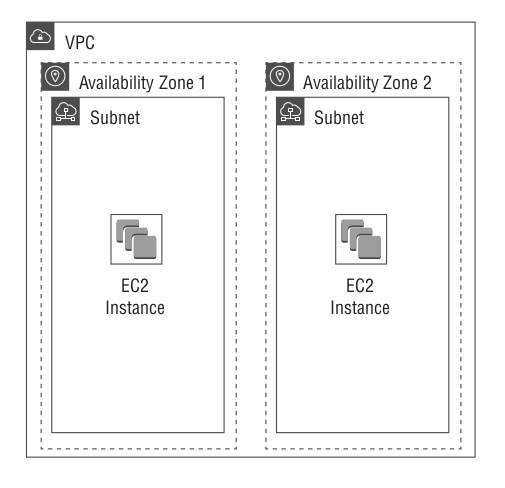
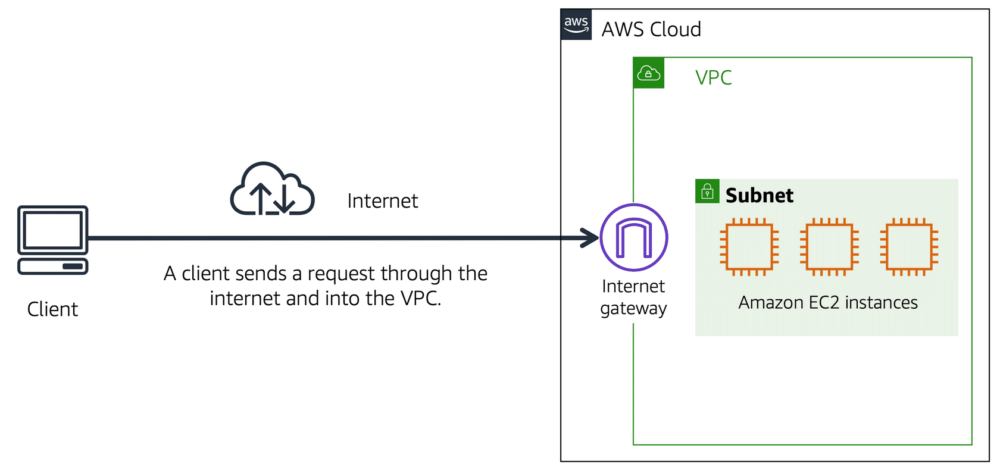

# The Core Networking Services

- Networking is ultimately about transporting data to and from your AWS resources. 
- How you achieve this depends on many factors, including the type of data, the speed of data
  transport, your security requirements, who or what will be accessing that data, and how
  they’ll be accessing it.

## Virtual Private Cloud

- The Amazon Virtual Private Cloud (VPC) service provides the network backbone for many
  AWS services. 
- A virtual private cloud is a virtual network in the AWS cloud that’s logically isolated from other networks.

### VPC CIDR Blocks

- Each VPC requires a Classless Inter-Domain Routing (CIDR - pronounced "cider") block to define the range of IPv4 addresses that resources within the VPC can use.
- Default VPCs have a CIDR of `172.31.0.0/16`, which includes all addresses from `172.31.0.0 ` to `172.31.255.255`.
- CIDR sizes must be between `/16` and `/28` - the smaller the CIDR size, the greater the number of IP addresses available to the VPC.
- Example CIDRs include:
  - `10.0.0.0/16 (10.0.0.0 – 10.0.255.255)`
  - `192.168.0.0/24 (192.168.0.0 – 192.168.0.255)`
  - `172.16.0.0/28 (172.16.0.0 – 172.16.0.15)`

- AWS can also assign an IPv6 CIDR block to your VPC, which will be a global unicast IPv6 address with a size of /56.

### Subnets

- A subnet provides logical separation and isolation of resources within the same VPC. For example, you may want to
  have web servers and application servers in the same VPC, but you want only the web servers to be accessible from the internet.
- You must define a CIDR for each subnet, with each subnet CIDR being a subset of the VPC CIDR, with a size between `/16` and `/28`.

- Each subnet exists only within a single Availability Zone.

### Internet Access

- An internet gateway is a VPC resource that allows EC2 instances to obtain a public IP address and access the internet.
- A subnet with a default route to an internet gateway is called a *public subnet*.

### Security Groups

- A security group is a firewall that determines what network traffic can pass into and out of an EC2 instance.
- Each EC2 instance must have least one security group attached.
- Security groups consist of inbound and outbound rules that permit network traffic according to IP address and protocol.
- By default all inbound traffic to an EC2 instance is blocked, while all outbound traffic is allowed (by default).
- A security group is a stateful rule, which means that it remembers what was allowed into the instance, and will automatically allow it it leave the instance - this is similar to a person entering a building with a key card, but leaving the same building without showing an identification.

### Network Access Control Lists

- A network access control list (NACL) is a firewall that operates at the subnet level and it's evaluated once a packet crosses a subnet boundary (inbound or outbound).
- A NACL consists of inbound and outbound rules that, by default, allow all traffic. 
- A NACL can’t restrict traffic between instances in the same subnet (a security group is used in this scenario), but it can prevent traffic from entering or leaving a subnet.

### VPC Peering

- A VPC *peering connection* is a private, point-to-point connection between only two VPCs.
- VPC peering allows resources in different VPCs to communicate with each other over the private AWS network instead of the internet.
- VPC peering connections are fast, reliable, and secure. 
- There’s also no need for VPC resources to have internet access in order to use VPC peering. 
- Peered VPCs can be in the same region or in different regions.

### Virtual Private Networks

- A virtual private network (VPN) allows you to connect a VPC to an external network, such as a data centre or office, via a secure connection that ***traverses the public internet***.

- To set up a VPN connection, you create a virtual private gateway and attach it to a VPC. You then configure your customer gateway — a physical or virtual router or firewall on your network — to connect to the virtual private gateway.
- VPN connections are encrypted using AES 128- or 256-bit encryption.
- A single VPC can have up to 10 VPN connections.

### Direct Connect

- Direct Connect provides private network connectivity to your VPC and other AWS services, without having a separate internet circuit just to access these services - this means you can bypass the internet altogether when accessing your AWS resources.
- Direct Connect links are offered through AWS Partner Network (APN) partners. Direct Connect operates using a dedicated link that operates at 1 or 10 Gbps, and thus avoids the high and unpredictable latency of a broadband internet connection.
- Hosted Direct Connect connection from APN partners are also available at slower speeds of 50 Mbps, 100 Mbps, 200 Mbps, 300 Mbps, 400 Mbps, and 500 Mbps.

## Route 53

- Route 53 is Amazon’s global Domain Name System (DNS) service.
- The primary purpose of DNS is to translate human-readable domain names (such as example.com ) into IP
  addresses.
- DNS can store mappings for different types of data, including IPv6 addresses, mail servers, and even arbitrary text.
- When you register a domain name, you must do so under a top-level domain (TLD) such as `.com`, `.net`, or `.org`.
- Route 53 is both a registrar and a DNS hosting provider.

### Hosted Zones

- To have Route 53 host the DNS for a public domain name, you create a public hosted zone and specify the domain name. You can then define the resource records for that domain. 
- If you use Route 53 to register a domain name, it automatically takes care of creating a public hosted zone for the domain.
- Route 53 can also provide name resolution for private domain names. A private domain name is one used on a network other than the internet (avoids hard coding IP addresses within applications).
- Because private domain names aren’t accessible from the internet, there are no registrars, so you can pick any domain name you want.
- Name resolution for private hosted zones is not available outside of the VPC you select.

### Routing Policies

- Route 53 supports a number of routing policies:
  - **Simple** - simply maps a domain name to a single static value, such as an IP address.
  - **Weighted** - distributes traffic across multiple resources according to a ratio (e.g. 10% of traffic.
  - **Latency** - sends users to resources in the AWS Region that’s closest to them (e.g. EU users to `eu-west-1` rather than `us-east-1`).
  - **Failover** - routes traffic to a primary resource unless it’s unavailable, in which case traffic will be redirected to a secondary resource.
  - **Geolocation** - lets you route users based on their specific continent, country, or state.
  - **Multivalue Answer** - evenly distributes traffic across multiple resource, unlike **Weighted** policies that return a single record, a **Multivalue Answer** policy returns all records, sorted in a random order.

### Health Checks

- All routing policies with the exception of Simple can use health checks to determine whether they should route users to a given resource.
- A health check can check one of three things: an endpoint, a CloudWatch alarm, or another health check.
- All health checks occur every 10 seconds or 30 seconds.
  - **Endpoint** - connects to the endpoint you want to monitor via HTTP, HTTPS, or TCP.
  - **CloudWatch Alarm** - monitor the status of a CloudWatch alarm, often used to check if the resource is experiencing high latency or is servicing a high number of connections.
  - **Calculated** - monitors the status of other health checks, such as a Endpoint health check and a CloudWatch alarm health check.

### Traffic Flow and Traffic Policies

- Route 53 Traffic Flow visual editor can be used to create a diagram to represent the desired routing.
- Route 53 doesn’t create the individual resource records but instead hides the routing behind the single policy record.
- The cost is currently $50 USD per month per policy record.
- Traffic Flow offers another routing policy that’s not otherwise available: Geoproximity. The Geoproximity routing policy lets you direct users to a resource based on how close they are to a geographic location. This differs from the Geolocation routing policy that routes based on the user’s specific continent, country, or state.

## CloudFront

- Amazon CloudFront is a content delivery network (CDN) that helps deliver static and dynamic web content to users faster than just serving it out of an AWS Region.
- CloudFront works by sending users to the edge location that will give them the best performance - typically, this is the edge location that’s physically closest to them.
- The more edge locations you use, the more redundancy you have and the better performance you can expect.
- You can’t select individual edge locations. Rather, you must choose from the following three options:
  - United States, Canada, and Europe
  - United States, Canada, Europe, Asia, and Africa
  - All edge locations

- To make your content available via CloudFront, you must create a distribution. A distribution defines the type of content you want CloudFront to cache, as well as the content’s origin.
  - **Web** - used for static and dynamic content such as web pages, graphic files, and live or on-demand streaming video via HTTP or HTTPS. The content's origin an be a web server or a public S3 bucket (non-public is not supported).
  - **Real-Time Messaging Protocol (RTMP)** - delivers streaming video or audio content to end users. To set up an RTMP distribution, you must provide both a media player and media files to stream, and these must be stored in S3 buckets.

