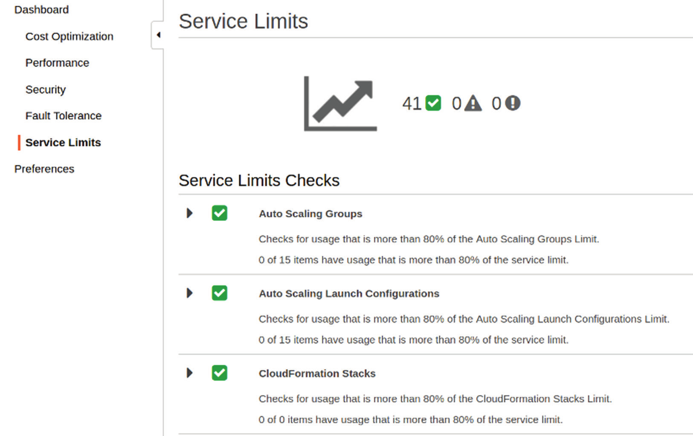

# Getting Support on AWS

Preparing and securing effective on-premises server workloads can be complicated and stressful. AWS provides layers of support designed to help you as you take your first confusing steps on the platform, learn about the many ways you can use AWS services, and struggle to optimise and secure your increasingly complex resources.

## Support Plans

When you create a new AWS account, you’re required to select a support plan. The free Basic Support plan is an option while you’re getting started, but for more advanced projects you'll want a support plan.

The price you’ll pay for support will depend on the amount your account is billed for AWS resource usage in a given month, the table below illustrates the costs.

| Developer                   | Business                   | Enterprise                                   |
| --------------------------- | -------------------------- | -------------------------------------------- |
| Greater of $29 or...        | Greater of $100 or...      | Greater of $15,000 or...                     |
| 3% of monthly account usage | 10% of usage up to $10,000 | 10% of AWS usage for the first $0 - $150,000 |
|                             | 7% of usage up to $80,000  | 7% of AWS usage from $150,000 - $500,0000    |
|                             | 5% of usage up to $250,000 | 5% of AWS usage from $500,000 - $1,000,000   |
|                             | 3% of usage over $250,000  | 3% of AWS usage over $1,000,000              |

Some worked examples:

- A medium sized company enrolled in the Business Support plan and in its first month consumed $25,000 in AWS resources. Since the monthly usage fell within the $10,000 to $80,000 range, it’s billed at 7%, or $1,750.
- A large organisation enrolled in the Enterprise Support Plan that spend $750,000 each month should probably would have to pay a 3% support "surcharge" of $22,500.

In both worked examples the "surcharge" for the support plan is less than each company hiring their own support staff. Some Key Benefits of the AWS Support Plans are outlined in the table below.

| Basic                    | Developer                                         | Business                                      | Enterprise                                           |
| ------------------------ | ------------------------------------------------- | --------------------------------------------- | ---------------------------------------------------- |
| 7 Trusted Adviser checks | 7 Trusted Adviser checks                          | All Trusted Adviser checks                    | All Trusted Adviser checks                           |
|                          | 8am to 6pm (local time) email access to associate | 24/7 email, chat, phone access to engineer    | 24/7 email, chat, phone access to senior engineer    |
|                          | General guidance within 24 business hours         | General guidance within 24 business hours     | General guidance within 24 business hours            |
|                          | System impaired help within 12 business hours     | System impaired help within 12 business hours | System impaired help within 12 business hours        |
|                          |                                                   | Production system down help within 1 hour     | Production system down help within 1 hour            |
|                          |                                                   |                                               | Business-critical system down help within 15 minutes |

In addition, an Enterprise Support plan will provide access to architectural and operational reviews, recommendations, and reporting.

- **Basic Support Plan**
  - No payment required (other than the regular costs of consuming AWS resources)
  - Access to publicly available documentation, including white papers, tutorials, and support forums.
  - Contact customer service at any time for account-related issues (such as bill payment)
  - Limited access to the Trusted Adviser tool
- **Developer Support Plan**
  - AWS recommends the Developer Support plan for organisations running non-production workloads (this is because support is only 8am - 6pm)
  - The associates you contact when you open a support ticket won’t be able to discuss specific problems you’re having or details about the way your particular application should be deployed
- **Business Support Plan**
  - Guarantees a response from a cloud support engineer via email, chat, or phone within one hour (less severe issues can take longer—up to 24 hours)
  - Support can include help troubleshooting interoperability between AWS resources and third-party software and operating systems
- **Enterprise Support Plan**
  - Enterprise plan is appropriate only for large operations whose scope is global and for whom downtime is simply unthinkable
  - Assigned a dedicated Technical Account Manager (TAM) who is assigned as a "guide and advocate" for your
    account
  - TAM becomes closely involved in your deployment, guiding your team through planning, launches, and proactive reviews—all optimised using best practices.
  - Enterprise customers get 24/7 access to senior cloud support engineers and a 15-minute response time for business-critical troubleshooting.

## Documentation and Online Help

- **Documentation**
  - AWS provides a lot of documentation resources and can be found at [https://docs.aws.amazon.com](https://docs.aws.amazon.com)
  - There are links to more than 100 AWS services along with tutorials and projects, software development kits, toolkits, and general resources.
  - Each service link is available able as HTML, PDF, Kindle (eBook), and GitHub (MarkDown formatted).
  - Look for the word latest in the web page’s URL, as this will ensure you are viewing the most recent version of the
    software, e.g. [https://docs.aws.amazon.com/AmazonS3/latest/user-guide/what-is-s3.html](https://docs.aws.amazon.com/AmazonS3/latest/user-guide/what-is-s3.html)
- **Knowledge Centre**
  - The AWS Knowledge Centre is basically a frequently asked questions page and can be accessed here [https://aws.amazon.com/premiumsupport/knowledge-center](https://aws.amazon.com/premiumsupport/knowledge-center).
  - The Knowledge Centre page contains links to nearly 1,000 questions arranged by service, each representing a fairly common problem encountered by real AWS customers. 
  - Examples include "How can I install the AWS CloudFormation helper scripts on Ubuntu or
    Red Hat Enterprise Linux?" and "What happens when my reserved instance expires?". Each question includes the answer, along with more links related to the information.
- **Security Resources**
  - AWS makes it perfectly clear that it wants your deployments to be as secure as possible.
  - Security resources are blogs, white papers, articles, and tutorials covering topics such as security best practices and encrypting your data in transit and at rest.
  - The page can be found [https://aws.amazon.com/security/security-resources](https://aws.amazon.com/security/security-resources)
- **Discussion Forums**
  - AWS discussion forums are similar to Stackoverflow but are focused upon AWS technologies and can be found at [https://forums.aws.amazon.com](https://forums.aws.amazon.com).
  - To post on the forum, you’ll need to be signed into your AWS account and have a forum nickname and email.

## Trusted Adviser

The Trusted Adviser is used to visually confirm whether your account resource configurations are sound and are compliant with best practices. The table below outlines the five alert categories.

| Category          | Purpose                                                      | Examples                                                     |
| ----------------- | ------------------------------------------------------------ | ------------------------------------------------------------ |
| Cost Optimisation | Identifies any resources that are running and costing you money but are either underutilised or inactive | EC2 instances or Redshift clusters that, over time, are mostly idle. |
| Performance       | Identifies configuration settings that might be blocking performance improvements | Inappropriate reliance on slower magnetic or low-throughput Elastic Block Store (EBS) volumes |
| Security          | Identifies any failures to use security best-practice configurations | Simple Storage Service (S3) buckets with publicly accessible permissions or security groups permitting unrestricted access |
| Fault Tolerance   | Identifies any running resources that, through poor configuration, are unnecessarily vulnerable to service disruptions | Data volumes that aren’t properly backed up or instances that aren’t replicated |
| Service Limits    | Identifies resource usage that’s approaching AWS Region or service limits | Your account is currently using close to the 100 Simple Storage Service (S3) buckets limit |

The status of an adviser check is illustrated by the icon next to a particular item (see example image below).

The full range of Trusted Adviser alerts is only available for users signed on to either the Business or Enterprise Support service tier. All other Support Plans (including Basic Support), access is limited to service limits and some of the security alerts.

