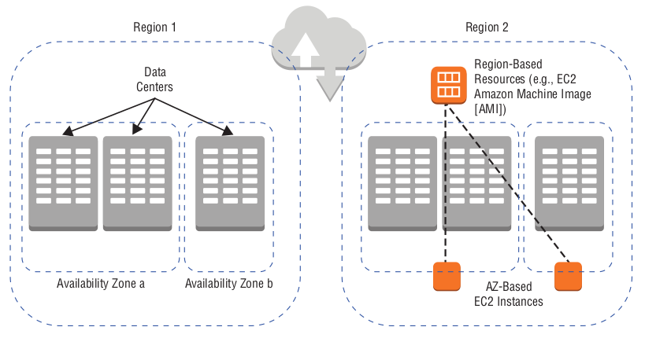
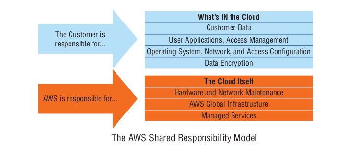

# Understanding the AWS Environment

Amazon’s hundreds of globally distributed data centres are divided into regions that, in turn, are further divided into Availability Zones. Applications can (and should be) designed to take the best advantages of the logical divisions.

## Regions

- AWS has hundreds of thousands of servers maintained within physical data centres located in a widely distributed set of geographic regions, such as:
  - us-west-1
  - us-east-2
  - eu-west-1
  - us-gov-west-1

  - The full list can be found here:
    [https://aws.amazon.com/about-aws/global-infrastructure](https://aws.amazon.com/about-aws/global-infrastructure).

- Not all regions are accessible from regular AWS accounts. Deploying resources into the U.S. government GovCloud region (or the AWS secret region designed for the U.S. intelligence community), requires special permissions.

- When requesting an instance of an AWS service, the underlying hardware of that instance will be carved out of a server running in one (and only one) AWS Region. EC2 instances, EBS volumes and S3 all have to live somewhere! Changing the region can be done via AWS Management Console (at the top right hand side of the screen), or via a CLI flag.

- Some resources, such as IAM, CloudFront and S3 are regarded as global services, as they do not exist in a single region. Note: S3 must exist within a single region, but it is classified as as global service.

- Dividing resources among regions provides the following:
  - Install your infrastructure close to your users to reduce latency
  - Install your infrastructure within national borders to meet regulatory compliance(s)
  - Isolate groups of resources from each other and from larger networks to allow the greatest possible security

- Services will have endpoints that can be used to access via application code or shell scripts, examples are:
  - ec2.us-east-1.amazonaws.com
  - rds.eu-west-3.amazonaws.com

  - All endpoints for each service can be found at [https://docs.aws.amazon.com/general/latest/gr/rande.html](https://docs.aws.amazon.com/general/latest/gr/rande.html).

## Availability Zones

- An AWS Region encompasses at least two distinct Availability Zones connected to each other with low-latency network links.

- The advantage of this level of separation is that if one Availability Zone loses power or suffers some, kind of catastrophic outage, the chances of it spreading to a second Availability Zone in the region are minimal. 

- You can assume that no two Availability Zones will ever share resources from a single physical data centre.

### Availability Zone Designation

- When launching an instance you will need to assign a network subnet associated with an Availability Zone, e.g. us-east-1a (us-east-1 plus Availability Zone a)
- Availability Zones are not listed in order in the subnet drop-down menu this is to prevent people from selecting the first item and overloading a given AZ

### Availability Zone Networking

- Organising resources into into network segments (or subnets) is generally recommend, for example a development subnet and a production subnet could not interfere with each other. Distribution of production workloads among multiple subnets can also make your applications more highly available and fault tolerant.
- A subnet is really nothing more than a single block of Internet Protocol (IP) addresses.
- Private networks—including AWS subnets—using the IPv4 protocol are allowed to use all the addresses within the address ranges:
  - 192.168.0.0 - 192.168.255.255 (Total of 65,536)
  - 172.16.0.0 - 172.31.255.255 (Total of 1,048,576)
- It is possible to divide each subnets into smaller subnets, and by default AWS permits up to 200 subnets per AZ.

### Availability Zones and High Availability

- A resource running without backup is known as a single point of failure.
- The only effective protection against failure is redundancy, which involves provisioning two or more instances of whatever your workload requires rather than just one - but they should not be sitting next to each other in the same data centre!
- AWS recommends preventing applications from failing by using autoscaling and load balancing:
  - Autoscaling can be configured to replace or replicate a resource to ensure that a predefined service level is maintained regardless of changes in user demand or the availability of existing resources.
  - Load balancing orchestrates the use of multiple parallel resources to direct user requests to the server resource that’s best able to provide a successful experience.

## Edge Locations

An edge location is a site where AWS deploys physical server infrastructure to provide low-latency user access to Amazon-based data. Not all services are available within edge locations, due to a much narrower set of hardware availability.

### Edge Locations and CloudFront

- CloudFront, Amazon’s CDN service, caches popular files/requests (served by other servers) located geographically close to your users, so that they do not have to go all the way to origin to access the resource.

- In addition to CloudFront, there are other AWS services that make use of edge locations, such as:
  - Amazon Route 53 - DNS administration tool
  - AWS Shield - DDoS detection system
  - AWS Web Application Firewall (WAF) - protects web applications from web-based threats
  - Lambda@Edge - serverless power of Lambda to customise CloudFront behaviour

### Regional Edge Cache Locations

- Regional edge cache is an extension to CloudFront, that will ensure that objects are maintained in edge location caches so long as there’s a steady flow of requests. Once the rate of new requests drops off, an object will be deleted from the
  cache, and future requests will need to travel back to origin.
- Objects rejected by edge locations can be moved to the regional edge caches. There aren’t as many such locations worldwide, so the response times for many user requests won’t be as fast, but that’ll still probably be better than having to go
  all the way back to the origin.
- By design, regional edge cache locations are more capable of handling less-popular content.

## Shared Responsibility Model

Amazon distinguishes between the security and reliability of the cloud, which is *its responsibility*, and the security and reliability of what’s *in the cloud*, which is up to the end user.

AWS is responsible for making sure that its locations are secure, reliably powered, and properly maintained, as well as patching, encrypting (where relevant), and maintaining the operating systems and virtualisation software running its physical servers and for the software running its managed services.

### Managed vs Unmanaged Resources

- A managed cloud service will "hide" all or some of the underlying configuration and administration work, allowing you to focus upon the application.
  - An example would be using an Amazon Relational Database Service (RDS) instance, rather than creating your own database from scratch with EC2.
- An unmanaged service is a service that is completely, owned and editable by the end user.
  - An example would be using AWS EC2 instance - you are responsible for the operating system and everything that’s running on it.
- Use this simple rule of thumb: *if you can edit it, you own it*.

### Service Health Status

- AWS makes regularly updated, region-by-region reports on the status of its services publicly available.
- Service outages will appear on Amazon’s Service Health Dashboard - [https://status.aws.amazon.com](https://status.aws.amazon.com).

### AWS Acceptable Use Policy

- The AWS Acceptable Use Policy makes it abundantly clear that it does not permit the use of its infrastructure in any illegal, harmful, or offensive way.
- Amazon reserves the right to suspend or even terminate your use of its services should you engage in illegal, insecure, or abusive activities
- Running penetration testing operations against your own AWS infrastructure can cause you trouble if you don’t get explicit permission from Amazon in advance.

- The policy can be found here: [https://aws.amazon.com/aup](https://aws.amazon.com/aup).