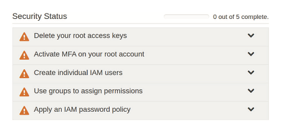

# Securing Your AWS Resources

AWS provides the Identity and Access Management (IAM) service to control which people and processes get past the wall guarding your resources (authentication) and what they’re allowed to do once they’re in (authorisation).

## AWS Identity and Access Management

- The IAM management dashboard provides various administration tools that can be used to managed the basics of account security.

- The Security Status section provides a number of suggestion such as locking down the root use and replacing the *effective* functionality of root by setting up IAM users and groups for your day-to-day administration tasks.

### Security Recommendations
- **Protect the Root User**
  - The root user has the permissions necessary to perform any task on your account without and additional authorisations.
  - Using the root account over a long term period presents a number of security risk - if the credentials are exposed then it is possible for anyone do anything with the account.
  - Best practises include protecting the root user by creating a complex password and implementing multi-factor authentication as well as use IAM users as much as possible.
- **Passwords**
  - Passwords should be complex and long that include uppercase and lowercase characters, numbers, and symbols - even better use randomly generated strings.
  - Password should never be reused across multiple accounts.
  - A password policy can enforce your password requirements, such as password length, requiring certain characters, prevention of password reuse, password expiration length etc.
  - *Multi-factor authentication* (MFA) can also be enabled, forcing the user will need to provide a temporary digital token sent through a preset device such as an Authenticator app.
- **Access Keys**
  - Programmatic and command-line access to many AWS resources is authenticated by access keys (without the option of MFA)
  - A set of keys can be generated from the AWS Management Console (via the *Security Credentials* page), but the credentials can only be viewed once (or downloaded once) — you’ll never be shown the secret access key itself again.
- **Secure Shell Key Pairs**
  - When you launch a new EC2 Linux instance, you’ll be prompted either to use an existing SSH key pair or to create a new one. 
  - Similar to access keys, you’ll get only one opportunity to download the private half of the SSH key pair to your own computer. Again, do so without publicly exposing this file.
  - You can obtain a shell to a remote AWS EC2 instance with `ssh -i keyname.pem ec2-user@<public_ip_address_of_instance>`.

### User, Groups and Roles

- **IAM Users**
  - When creating an IAM User (From the IAM Dashboard) you can choose any polices required. For example if you wanted to create a primary admin to replace your root user for day-to-day administration you would select the AdministratorAccess policy.

- **IAM Groups**
  - Group can be used to administrate the permissions associated with multiple users (much in the same way Linux has Groups).
  - For example an S3-admins group could be created for users who need to administer S3 buckets, but do not need access to any other part of the AWS platform,.

- **IAM Roles**
  -  IAM roles define the limits for what can be done within your AWS account by an application or service (rather than people).
  - When creating a role, you begin by defining a *trusted entity*—the entity (or beneficiary) that will be trusted to use the role, such as an AWS service (like EC2), or an identity provided by a third-party federated identify provider (like Google or Microsoft).
  - You might, for instance, need to give users logged in to your mobile application through their Google accounts access to specific resources on AWS services (such as data kept on S3).

### Federated Access

- You can integrate third-party standards like the *Security Assertion Markup Language 2.0* (SAML) or Microsoft’s Active Directory into your infrastructure — this is referred to as Federated Access.
- This lets you use users’ existing login sessions to add *single sign-on* (SSO) across your AWS infrastructure and enable seamless access between your mobile apps and backend resources like DynamoDB databases or S3-based objects.

### Credential Report

- The credential report contains important information about the state of your account security, listing all current IAM users and giving you key intelligence, such as when each of them last logged in, whether they have MFA enabled, whether they have active access keys, and when those keys were last rotated.
- The credential report can only be downloaded as a .csv file.

## Encryption

- Encryption keys are mostly managed on AWS by the AWS *Key Management Service* (KMS).
- When you select to encrypt an AWS resource, KMS will apply encryption using a customer master key (CMK) that’s been generated especially for your account. 
- You can manage your keys — including creating new keys or scheduling the deletion of old ones — through either the KMS Dashboard or the Encryption Keys page within IAM.
- Just about any data managed by an AWS service can be encrypted, examples include Relational Database Service (RDS) and DynamoDB databases.
- When they’re encrypted, those resources will, for all practical purposes, be unreadable without the decryption key. AWS will invisibly decrypt your data only when the access request is accompanied by successful authentication.
- Encryption for S3 works in much the same way, but there’s a twist. You can have S3 encrypt the objects of a bucket at any time — during or after bucket creation. You can select either S3-managed server-side encryption keys (SSE-S3) or KMS-managed keys (SSE-KMS).

## Regulatory Compliance (AWS Artifact)

- AWS Artifact is a set of links to documents describing various regulatory standards and how AWS meets them. Each of those documents is referred to by Amazon as an *artifact*.
- When you choose a link, you’re first asked to agree to the terms and conditions included in an AWS Artifact nondisclosure agreement. When you choose the agreement box, the actual artifact will be generated, opening a download pop-up.
- Example documents include:
  - U.S. government’s Federal Risk and Authorization Management Program (FedRAMP)
  - Government of Canada (GC) Partner Package
  - Australian Prudential Regulation Authority (APRA) 
  - The "Management of Security Risk in Information and Information Technology" workbook
  - PCI DSS Attestation of Compliance (AOC) 
  - Responsibility Summary for handling credit card transaction data
