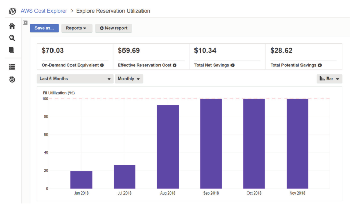
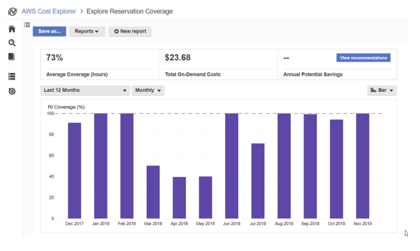

# Working with Your AWS Resources

## The AWS Management Console

- The AWS Console is a point and click web interface that you can use to manage all of your AWS cloud resources using a
  web browser. 

- To access the AWS Management Console, browse to https://console.aws.amazon.com in your web browser. There are two ways to sign in:
  - As the root user - which requires the email address and password associated with your AWS account
  - As an Identity and Access Management (IAM) user - which requires the account ID or account alias, as well as the IAM username and password
- All AWS Management Console login session wil llast for 12 hours.

### Service Console

- Each AWS service has its own service console that can be accessed via the top-right "Services" link
- Frequently used services can be pinned to the shortcuts navigation bar
- Most services are region specific (apart from IAM, Route 53 and S3 which are global), so make sure you've selected the correct region (also found at the top-right hand side)

### Account Name Menu

- The account name menu in the navigation bar displays the IAM user and account alias or ID you’re logged in as, or the name associated with your AWS account if you’re logged in as root.
- The menu provides access to:
  - My Account - takes you to the Billing service console page that displays your account information
  - My Organisation - takes you to the AWS Organisations service console
  - My Billing Dashboard - takes you to the Billing and Cost Management Dashboard
  - My Security Credentials - takes you to the My Password page in the IAM service console where you can change your password
  - Switch Role - lets you assume an IAM role where you can perform tasks as a different principal with different permissions
  - Sign Out

### Resource Groups

- Resource groups let you view, manage, and automate tasks on multiple AWS resources at a time. They are ideal for grouping AWS resources that all compose a particular application.
- A resource group is a collection of AWS resources in the same region that match the results of a query:
  - ***Resource tags*** are optional metadata that you can assign to AWS resources. A tag must contain a label called a key and may optionally contain a value (e.g. tag all application components with an appName key and value myApp). You can assign multiple tags to a resource, up to 50
  - ***AWS CloudFormation stacks*** let you programmatically deploy and manage multiple AWS resources as a single unit called a stack. You can create resource groups that contain some or all of the resources in a CloudFormation stack.

### Tag Editor

- If you want to create a resource group based on tags, you’ll first need to tag the resources you want to include in the group.
- Choose the Resource Groups link in the navigation bar of the AWS Management Console, and then choose Tag Editor.
- Create a query to find the resources you want to tag, but as a minimum, you must select at least one region and one or more resource types, such as EC2 instances, EC2 volumes, VPCs, or S3 buckets. Optionally, you can list resources that already have an existing tag. All resource wil lbe shown that match the given query, to which you can then tag each resource as required

- **Tagging Strategies**
  - **Technical** - tags are applied based upon technical properties of the resource, such as role (web server, database etc) or phase (development, stage, production).
  - **Automation** - tags can be used to define the resources that should be part of an automation process such as deleting old snapshots, or turning off development servers after hours. You could specify Date or Time tags to specify when automation tasks should occur
  - **Business** - tags can be used to group resources into categories that the business can use for billing, management, and analysis, examples include Cost Center, Project Name, Customer Name etc.
  - **Security** - tags can be used to apply conditions within IAM policies to look at resource tags to determine whether to allow a particular action, for example you can specify a condition that permits an EC2 instance to access a production database only if the instance has the `environment` tag with the value `production`. You may also need to tag based upon confidentiality or compliance of a given service.

### AWS Console Mobile Application

- The AWS Console Mobile Application is a smartphone application that lets you manage your AWS account and resources on the go.
- The following information can be viewed from mobile application:
  - Service Health - View any current health issues with AWS services across different regions.
  - CloudWatch Alarms - View alarm graphs and current alarm status.
  - Billing - View your current billing balance and a graph of usage charges

- Limited changes to some AWS resources are supported such as modifying CloudWatch Alarms, EC2 security groups, EC2 instances, and CloudFormation stacks, as well as being able to stop or reboot an EC2 instance.
- Only the following AWS services and resources are supported within the Mobile Application:
  - AWS Billing and Cost Management
  - AWS CloudFormation
  - Amazon CloudWatch
  - Amazon DynamoDB
  - Amazon EC2
  - AWS Elastic Beanstalk
  - Elastic Load Balancing
  - AWS OpsWorks
  - AWS Personal Health Dashboard
  - Amazon Relational Database Service (Amazon RDS)
  - Amazon Route 53
  - Amazon Simple Storage Service (Amazon S3)
  - Amazon Virtual Private Cloud (Amazon VPC)
- The AWS Console Mobile Application supports the following authentication methods
  - Root account credentials
  - An IAM username and password
  - An access key ID and secret key

## AWS Command Line Interface

- The AWS CLI is a unified command-line tool to manage your AWS resources - anything you can do in the AWS Management Console, you can do from the terminal using the AWS CLI.
- The AWS CLI is compatible with Windows, macOS, and Linux, and requires outbound access on TCP 443. You will also need an IAM access Key ID and secret key to authenticate with.
- Installation of the CLI will require Python 2.6.5 or Python 3.3 or higher, and can be done via PIP or via the standalone installer.  The AWS CLI comes preinstalled on Amazon Linux AMIs.

## Software Development Kits

- Application developers can use the AWS SDK to integrate their applications with AWS services easily and reliably.
- AWS offers SDKs for the following programming languages and ecosystems:
  - Java
  - .NET
  - Node.js
  - PHP
  - Python
  - Ruby
  - JavaScript
  - Go
  - C++
  - AWS Mobile SDK for Android
  - AWS Mobile SDK for iOS
  - AWS Mobile SDK for Unity
  - AWS Mobile SDK for .NET and Xamarin
  - AWS Amplify (build an application backend on AWS and integrate it with your Android, iOS, and web applications)

### IoT SDKs

- You can use the AWS IoT SDKs to create applications that run on Internet of Things (IoT) devices, such as sensors, microcontrollers or smart appliances.

- Using the AWS IoT SDKs and the AWS IoT platform, applications running on these devices can integrate with other AWS services, including the following:
  - Amazon S3
  - Amazon DynamoDB
  - Amazon Kinesis
  - AWS Lambda
  - Amazon Simple Notification Service
  - Amazon Simple Queue Service

- The AWS IoT SDKs allow developers to optimise memory, network, and power usage, reduce the size of applications; and ensure secure, fast communication with AWS.
- IoT device SDKs are available for the following languages and platforms:
  - Embedded C
  - JavaScript
  - Arduino Yún
  - Python
  - Java
  - C++

## CloudWatch

- Amazon CloudWatch is a key service that helps you plan, monitor, and fine-tune your AWS infrastructure and applications. 
- It lets you collect, search, and visualise data from your applications and AWS resources in the form of logs, metrics, and events, such as:
  - **Infrastructure monitoring and troubleshooting**  - visualise performance metrics to discover trends over time and spot outliers that might indicate a problem. Correlate metrics and logs across your application and infrastructure stacks to understand the root cause of failures and performance issues.
  - **Resource optimisation** - save money and help with resource planning by identifying over-used or underused resources. Ensure performance and availability by using AWS Auto Scaling to automatically provision new EC2 instances to meet demand.
  - **Application monitoring** - create alarms to alert you and take corrective action when a resource’s utilisation, performance, or health falls outside of a threshold that you define.
  - **Log analytics** - search, visualise, and correlate logs from multiple sources to help with troubleshooting and identify areas for improvement.

### CloudWatch Metrics

- CloudWatch Metrics collects numeric performance metrics from both AWS and non-AWS resources (such as on-premises servers).
- A metric is a variable that contains a time ordered set of data points. Each data point contains a timestamp, a value, and optionally a unit of measure, for example CPU utilisation metric for an EC2 for a given instance at a particular time.
- All AWS resources automatically send their metrics to CloudWatch, and metrics are stored for up to 15 months.

### CloudWatch Alarms

- A CloudWatch alarm watches over the value of a single metric. 
- If the metric crosses a threshold that you specify (and stays there), the alarm will take an action, for example CPU utilisation is greater than 80% for five minutes.
- An action can be one of the following:
  - **A notification** can be raised via the **Simple Notification Service (SNS)** service, which in turn publishes the notification. All subscribers will receive  the published message, and handle it. Example handlers include:
    - HTTP(S)
    -  Simple Queue Service (SQS)
    - Lambda
    - Mobile push notification
    - Email or Email-JSON
    - Short Message Service (SMS) text messages
  - An **Auto Scaling** action will instruct the EC2 Auto Scaling service to add (or remove) EC2 instances in response to changing demand.
  - An **EC2 action** can be used to monitor a specific instance that’s having a problem, you can use an EC2 action to stop, terminate, or recover the instance (note: Recovering an instance migrates the instance to a new EC2 host).

### CloudWatch Dashboards

- CloudWatch dashboards are your one-stop shop for keeping an eye on all of your important metrics.
- You can create multiple dashboards and add to them metric graphs.
- You can save your dashboards for future use and share them with others. Dashboards can also visualise metrics from multiple AWS Regions, so you can keep an eye on the global health of your infrastructure

### CloudWatch Logs

- CloudWatch Logs collects and stores log files from AWS and non-AWS sources and makes it easy to view, search, and extract custom metrics from them.

#### Log Events, Streams, and Groups
- You configure your applications and AWS services to send log events to CloudWatch Logs.
- A log event is analogous to a line in a log file and always contains a timestamp and an event message. 
- Many AWS services produce their own logs called vended logs that you can stream to CloudWatch Logs (such as Route 53 DNS query logs).
- CloudWatch Logs can also receive custom logs from your applications, such as NGINX web server access logs.

- CloudWatch Logs organizes log events by log streams by storing log events from the ,same source in a single log stream. For example, web server access logs from a specific EC2 instance would be stored in one log stream, and Route 53 logs in another.
- CloudWatch further organises related log streams into log groups, for example multiple web servers can be grouped into a log group.
- CloudWatch Logs stores log events indefinitely by default, but you can configure a log group’s retention settings to delete events automatically. Retention settings range from 1 day to 10 years. You can also archive your logs by exporting them to an S3 bucket.

#### Metric Filters

- A metric filter extracts data from log events in a log group and stores that data in a custom CloudWatch metric.
- For example, suppose a log event from a database server contains the time in milliseconds it takes to run a query. You may extract that value and store it as a CloudWatch metric so you can graph it and create an alarm to send a notifi cation when it
  exceeds a certain threshold.
- You can also use metric filters to track the number of times a particular string occurs. This is useful for counting the number of times a particular event occurs in a log, such as an error code.

### CloudWatch Events

- CloudWatch Events lets you continuously monitor for specific events that represent a change in your AWS resources - particularly write-only API operations - and take an action when they occur.
- For example, an EC2 instance going from the running state to the stopped state would be an event.

- You start by creating a rule to define the events to monitor, as well as the actions you want to take in response to those events. You define the action to take by selecting a target, which is an AWS resource. Examples include
  - Lambda functions
  - EC2 instances
  - SQS queues
  - SNS topics
  - ECS tasks

- CloudWatch responds to events as they occur, in real time. Unlike CloudWatch alarms, which take action when a metric crosses and remains crossing a numeric threshold, CloudWatch events trigger immediately.
- For example, you can create a CloudWatch event to send an SNS notification whenever an EC2 instance terminates.

## CloudTrail

- CloudTrail keeps detailed event logs of every action that occurs against your AWS resources. 
- Each event that CloudTrail logs includes the following parameters:
  - The service - specifically, this is the address of the service’s global endpoint, such as iam.amazonaws.com for IAM.
  - The name of the API action performed - such as `RunInstances`, `CreateUser`, or `PutObject`.
  - The region the resource is located in - for global services, this is always us-east-1.
  - Response elements -  in the case of an API operation that changes or creates a resource, this contains information about the results of the action. For example, launching a new EC2 instance would yield information such as the instance ID and private IP address.
  - The principal that made the request - this may include the type of principal (IAM user or role), its Amazon resource name (ARN), and the name.
  - The date and time of the request - given in coordinated universal time (UTC).
  - The IP address of the requester.

- CloudTrail logs consist of two different actions: API and non-API actions.
  - An **API action** include things such as launching an instance, creating an S3 bucket, creating a new
    IAM user, or taking an EBS snapshot (anything that requires the infrastructure to do something)
  - A **non-API action** include everything else, such as logging into the management console

- CloudTrail also classifies events along two other dimensions: management events and data events.
  - Management events - also known as control plane operations - are operations that a principal (such as a user or service) attempts to execute against an AWS resource. Examples include:
    - Write-only events, such as launching an EC2 instance via the `RunInstances` API operation
    - Read-only events, such as returning a list of EC" instances via the `DescribeInstances` API operation
  - Data events consist of S3 object-level activity and Lambda function executions, both of which tend to be high volume, and thus are treated separately.

- CloudTrail logs all of your management events automatically, and stores 90 days of management events in the event history, which you can view, search, and download at any time.

- If you want to customise the types of events CloudTrail logs - such as specific management or data events - or if you need to store more than 90 days of event history, you need to create a trail.
- A trail is a configuration that directs CloudTrail to record specified events in log files and deliver them to an S3 bucket. A trail can log events from either a single region or all regions. You can choose to log management events, data events, or both. You can also choose whether to log read-only or write-only events, or both.
- Log file integrity validation is an optional feature that provides assurance that no CloudTrail log files are surreptitiously modified or deleted - every time CloudTrail writes a log file to the trail’s S3 bucket, it calculates and stores a cryptographic hash of the file.
- Log files can be encrypted using server-side encryption with Amazon S3-managed encryption keys (SSE-S3) or server-side encryption with AWS KMS-managed keys (SSE-KMS).

## Cost Explorer

- AWS Cost Explorer is a feature of AWS Billing and Cost Management that offers configurable reports and graphs to help you understand how each of your AWS services impacts your monthly bill.
- AWS Cost Explorer offers the following three categories of reports

### Cost and Usage Reports

- Cost and usage reports can be genereted to give you a graphical view of your daily and monthly costs and usage over time. 
- It can also show you the forecast for the current month, 3 months out, and 12 months out.
- You can go back as far as one year, and filter by the following parameters:
  - Service
  - Availability Zone
  - Region
  - Instance type
  - Usage type
  - Tag
  - API operation
  - Charge type
  - Platform

- Cost Explorer offers the following five default cost and usage reports:
  - **Monthly costs by service** - displays your top five most expensive services over the past sixmonths
  - **Monthly costs by linked account** - ffff
  - **Monthly EC2 running hours costs and usage** - disaplys two graphs showing the costs and running hours of your EC2 instances
  - **Daily costs** - shows your monthly spend for the last six months and a forecast for the current month
  - **AWS marketplace** - shows license, subscription, and usage costs for 3rd part software via the AWS marketplace

### Reservation Reports

- Cost Explorer offers the following two built-in reservation reports to give you insight on how much you are saving - or could have saved - with instance reservations.

#### Reserved Instances Utilization

- The Reserved Instances Utilization report shows you the percentage of your reserved instances you’ve used and how much money you’ve saved or overspent by using reserved instances. 
- The report also shows you your net savings from reserved instances, giving you insight into whether you’ve had too few or too many reserved
  instances.

#### Reserved Instances Coverage

- The Reserved Instances Coverage report tells you how many of your running instance hours are covered by instance reservations, how much you’ve spent for on-demand instances, and how much you could have saved by purchasing reserved instances.

### Reserved Instance Recommendations

- Cost Explorer can provide reserved instance recommendations to help reduce your costs.
- It works by analysing your on-demand instance usage over the past 7, 30, or 60 days. It then searches for all available reserved instances
  that would cover that usage. Finally, it selects the most cost-effective reserved instances and recommends them.
- Costs Explorer makes recommendations separately for each service such as EC2 or RDS.
- Cost Explorer ignores any usage that’s already covered by a reservation. So, if your instances are already fully covered by instance reservations, Cost Explorer will not make any recommendations.

